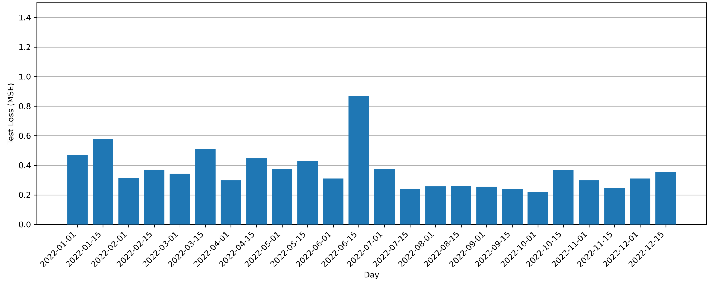
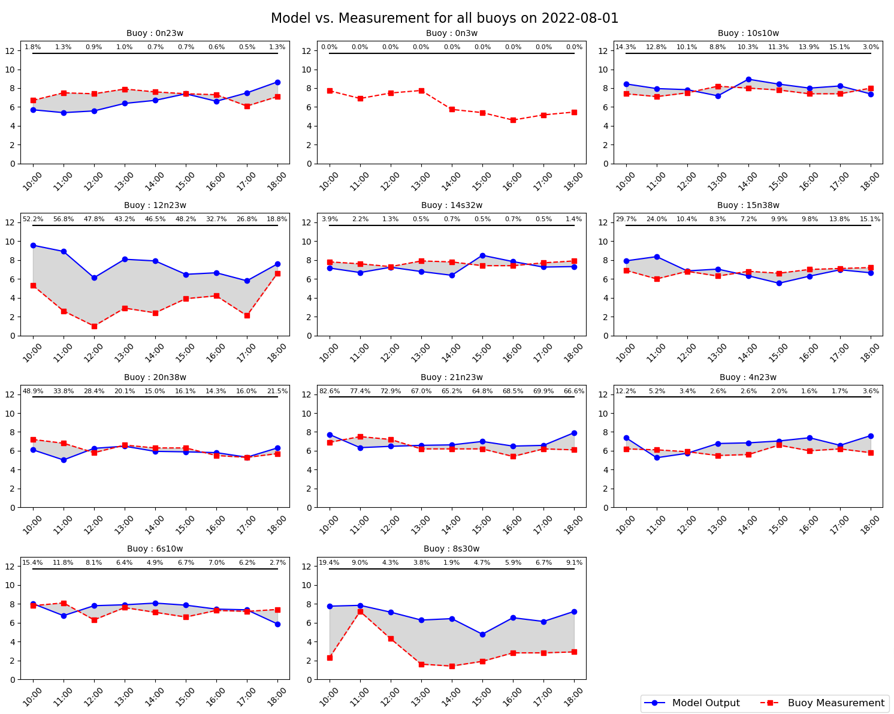

# Validation and biases

Three different validation procedures assess the accuracy of the model. The first validation step is done post model-training using a **test dataset** unseen during training that includes 10% of the total daily dataset. This is standard procedure in deep learning tasks. The second validation comes from **buoy data** from the PIRATA buoy array over the Atlantic. This data is external and completely unseen in model training. The third layer of validation comes from comparing visually the model output to the **ERA5 reanalysis** dataset. This page presents the analysis for the C06 model which presents the best prediction in terms of test MSE score.

## Test score per day

With the WindScanGEO framework, a model is trained every day with the corresponding scatterometer training data. The following figure presents the test score for each tested day of 2022.

- All models achieve **MSE < 1**, with the worst performance on **2022-06-15**.
- This variation suggests that model accuracy depends on the atmospheric conditions of the specific day.
- The test MSE score can serve as a daily reliability indicator.

## External evaluation using buoys

To assess real-world performance, WindScanGEO outputs are compared with wind speed measurements from the **PIRATA buoy array**.

**Native scatterometer bias**

Bias of all four scatterometers used in training (Metop-B, Metop-C, HY2B, HY2C). This bias is native to the dataset used in training. It will be inherited to any models that are trained on its data. Scatterometers struggle to detect low wind speed. A positive bias of nearly 2 m/s can be found.

**C06 Model bias**

The inherited low wind speed bias can be seen in the trained model. It is amplified by a factor of up to 2, with a positive bias of nearly 4 m/s at wind speeds between 1-2 m/s. To be noted that there are very few samples at those low wind speeds compared to the wind speeds around the mean (approx. 7 m/s) where the bias is low (< 1 m/s)

# C06 Buoy Comparison

The following plot shows the differences between model and buoy throughout the year. 
- Most days show an error of **< 1-2 m/s**.
- A few days present errors up to **6 m/s**, mostly during **low wind speed conditions**.

Time series of each buoy can be found in the [Github repo](https://github.com/yongxingloo/)

The model presents very large areas mostly at moments where actual wind speeds are low. This confirms our model bias presented before where we saw that the model is unreliable under 4 m/s.

In the plot above, Buoys at **12°N 23°W** and **8°S 30°W** recorded very low wind speeds.
- The model fails to capture these, consistent with the earlier bias analysis.

# C06 ERA5 Comparison

- WindScanGEO captures **similar large-scale dynamics** to ERA5.
- It also produces **more detailed fine-scale structures**, though it's difficult to assess which is more accurate without ground truth.

    15th of March 2022

<video width="5000" controls>
    <source src="../video/2022-03-15_ERA5.mp4" type="video/mp4">
</video>

All comparison for tested days can be found inthe [Github repo](https://github.com/yongxingloo/)
